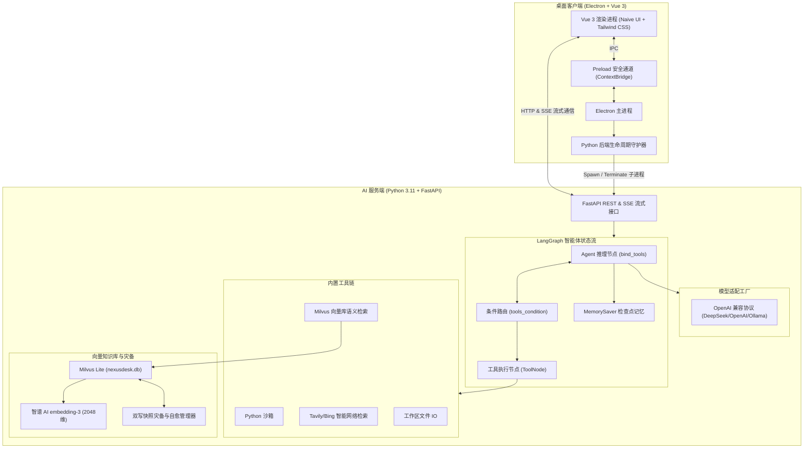

# NexusDesk (智能 AI Agent 桌面工作站)

基于 **Python + LangChain / LangGraph 全家桶** 与 **Electron + Vue 3 (Naive UI + Tailwind CSS)** 构建的高性能现代化 Agent 桌面客户端。

---

## 🌟 核心特性 (Features)

1. **LangGraph 状态机驱动 (StateGraph Engine)**
   - 采用 LangGraph 现代状态流设计，支持循环图决策（Reasoning Loop）与状态条件路由（`tools_condition`）。
   - 内置 `MemorySaver` 检查点记忆，实现多轮对话上下文持久化与会话追溯。
   - 支持多种运行模式：
     - **⚡ ReAct Autonomous Agent**：自主规划、多步工具调用与结果归纳。
     - **🧠 Multi-Agent Orchestrator**：Supervisor 智能协调拆分任务，调度专用 Agent。
     - **📚 Knowledge RAG**：深度聚焦本地私有向量数据库检索增强。
     - **💬 Direct Chat**：极速对话流式输出。

2. **现代化桌面端交互 (Electron + Vue 3 + Naive UI)**
   - **双模运行**：Electron 桌面主进程可自动拉起、监控、管理 Python FastAPI 后端进程（退出时自动清理），也支持前后端独立开发调试。
   - **实时流式与思考链可视化 (CoT)**：支持 Server-Sent Events (SSE) 协议实时流式返回 Token、节点状态变化、以及 DeepSeek-R1 / Agent 思维链折叠卡片。
   - **交互式工具执行卡片**：可视化展现各工具的入参（JSON Schema）与执行结果，执行状态（运行中、成功、异常）一目了然。
   - **暗黑 / 明亮主题无缝切换**。

3. **内置工具集沙箱 (Extensible Tool Ecosystem)**
   - 🐍 **Python Sandbox Executor**：安全沙箱执行 Python 代码，实时捕获标准输出、错误与表达式求值。
   - 🌐 **Web Search**：Tavily / Bing / DuckDuckGo 智能无缝回退互联网检索，实时获取最新资讯。
   - 📁 **Workspace File Operations**：安全在工作区内创建、编辑、读取及列举本地文件。
   - 🔍 **Knowledge Base Retrieval**：Agent 可自主调用语义向量检索查询本地资料。

4. **高性能向量知识库 (Milvus Lite + 智谱 AI embedding-3)**
   - 内置轻量级内嵌向量库引擎 **Milvus Lite**，单文件持久化，毫秒级响应，零 Docker 依赖。
   - 搭载 **智谱 AI `embedding-3`** 高精度向量化模型（2048 维度），中文语义理解与长文检索召回表现卓越。
   - **【方案 C】数据安全与灾备自愈体系**：支持全自动双写本地快照与系统级冗余（`~/.nexusdesk/backups/`），具备误删自动自愈重建、全量备份导出与一键还原能力，彻底解决本地数据库丢失风险。

5. **统一大模型适配层 (Unified LLM Factory)**
   - 兼容标准 OpenAI 协议规范，开箱即用支持：
     - **DeepSeek** (`deepseek-chat`, `deepseek-reasoner` R1)
     - **OpenAI** (`gpt-4o`, `gpt-4o-mini`)
     - **Ollama** 本地大模型 (`llama3.2`, `qwen2.5` 等)
     - **阿里云通义千问** (`qwen-turbo`, `qwen-max`)
     - **月之暗面 Kimi** (`moonshot-v1-8k`)
     - **智谱清言** (`glm-4-flash`, `glm-4`)
   - 界面内置一键连通性测试与延迟探测。

---

## 🏗️ 架构拓扑 (Architecture)



---

## 📁 目录结构 (Directory Structure)

```text
nexusdesk/
├── backend/                       # Python 后端项目
│   ├── app/
│   │   ├── agents/                # LangGraph 状态图与工作流
│   │   │   ├── graph.py           # 状态机构建、编译与 MemorySaver
│   │   │   └── state.py           # AgentState 定义
│   │   ├── api/                   # FastAPI 路由层
│   │   │   ├── chat.py            # SSE 流式问答与会话历史
│   │   │   ├── rag.py             # 知识库管理、灾备与语义测试
│   │   │   ├── tools.py           # 工具列表探针
│   │   │   ├── models.py          # 模型配置与测试
│   │   │   └── health.py          # 健康检查探针
│   │   ├── chains/                # LangChain LCEL 声明式链
│   │   │   ├── rag_chain.py       # RAG 检索生成流水线
│   │   │   ├── planner_chain.py   # 结构化任务规划与步骤拆解链
│   │   │   └── summary_chain.py   # 智能上下文压缩与摘要链
│   │   ├── core/                  # 配置项管理 (config.py)
│   │   ├── llm/                   # 统一大模型工厂 (factory.py)
│   │   ├── rag/                   # Milvus 向量库与灾备自愈引擎 (vector_engine.py)
│   │   └── tools/                 # 内置工具 (python sandbox, search, fs)
│   ├── data/                      # 运行时数据 (本地向量库、工作区、灾备备份)
│   ├── tests/                     # 自动化测试用例
│   ├── requirements.txt           # Python 依赖清单
│   └── main.py                    # FastAPI 启动主入口
├── frontend/                      # 前端桌面端项目
│   ├── electron/                  # Electron 主进程与预加载脚本
│   │   ├── main.ts                # 桌面窗口创建与 IPC
│   │   ├── preload.ts             # 预加载安全通道
│   │   └── python-manager.ts      # Python 后端子进程生命周期守护
│   ├── src/                       # Vue 3 渲染进程源码
│   │   ├── api/                   # SSE 客户端与 REST 请求
│   │   ├── components/            # 消息卡片、思维链折叠、工具状态卡片
│   │   ├── stores/                # Pinia 状态中心 (chat, settings, rag)
│   │   ├── views/                 # 问答台、知识库、工具总览、模型设置
│   │   ├── App.vue                # 根应用与 Naive UI 主题容器
│   │   └── main.ts                # 前端入口
│   ├── package.json               # 前端依赖与脚本
│   └── vite.config.ts             # Vite 构建与 Electron 插件配置
└── README.md
```

---

## 🚀 快速启动 (Quick Start)

### 1. 环境准备
- **Python**: `>= 3.10`（推荐 Python 3.11）
- **Node.js**: `>= 18.0`（已内置 `npm`）

### 2. 启动基础设施（Docker：PostgreSQL + Milvus）

```bash
# 在项目根目录启动 PostgreSQL（会话持久化）与 Milvus standalone（向量库，含 etcd/minio）
docker compose up -d

# 查看容器健康状态
docker compose ps
```

> 首次启动会拉取镜像（Milvus 约 1GB）。如需回退本地单文件模式，将 `backend/.env` 中 `MILVUS_URI` 改为 `data/milvus/nexusdesk.db` 即可（Milvus Lite，零依赖）。

### 3. 后端配置与启动

```bash
# 1. 进入后端目录
cd backend

# 2. 复制环境变量配置文件并填入相关 API Key
cp .env.example .env

# 3. 运行后端服务：
./venv/bin/python3 main.py --port 8000
```
> 后端默认运行在 `http://127.0.0.1:8000`，API 交互文档可访问 `http://127.0.0.1:8000/docs`。
> 启动时会自动连接 PostgreSQL 初始化会话检查点（连接失败时自动回退内存模式并打印警告）。

### 4. 前端与 Electron 桌面端启动

```bash
# 进入前端目录
cd frontend

# 安装依赖（首次运行）
npm install

# 启动桌面开发模式（支持热重载，自动唤醒后端守护进程）
npm run dev
```

### 5. 一键构建与打包

```bash
cd frontend
# 构建生产环境 Web 资源与 Electron 客户端
npm run build:vue

# 打包为独立桌面应用安装包 (macOS DMG / Windows NSIS / Linux AppImage)
npm run electron:build
```

---

## ⚙️ 模型与知识库配置说明

启动进入应用后，点击左侧导航的 **设置 (Settings)**：
- **对话模型**：选择预设（如 **DeepSeek Chat**、**OpenAI GPT-4o**、**Ollama Local** 等），输入对应 API Key，点击 **测试连接**。
- **向量知识库**：基于 Milvus Lite + 智谱 AI `embedding-3`（2048 维度），在后端 `.env` 中配置 `ZHIPUAI_API_KEY` 即可开箱即用，支持全文检索、文档批量分块与自动灾备自愈重建。
